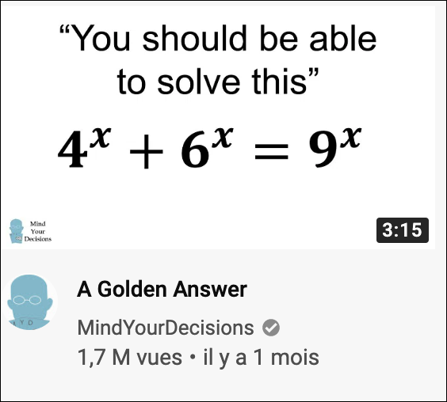
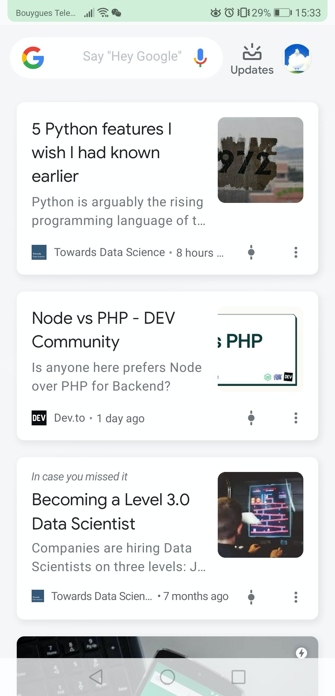

不用再拼课
看视频的标题应该让人有想表达的欲望
you can sing this too + 迪玛希

金句开头
Change Is the Only Constant: The Wisdom of Calculus in a Madcap World
【浙大学姐】我是如何戒掉手机玩命学习
【妈妈我要学习】让记忆效率提升300%的心

撒花！《交互式

取名，颜值，声音，品牌
How to pronounce 'H' in English -- not 'A' or 'R'!

大白话讲一下
我这个回答是人都看得懂
说人话
刚刚上了一节，给大家来讲讲
人在实验室，刚下飞机
我这个回答跟其他的都不一样

误解
痛点（需求）  法专生教你学法语p

最新更新

Fluent Forever: How to Learn Any Language Fast and Never Forget It

自学痛点 : 没有框架不系统不知道怎么计划没有练习没有反馈

甩金句:觉得法语难搞就找猫博士，时间短见效快，包你欲罢不能

别到处乱查了，
什么什么哪家强
蓝翔

虎躯一震
知道真相的我眼泪留下来

暴力学习包你药到病除

得了灰指甲，一个传染俩，要想怎么办，赶快用亮甲

一顿操作猛如虎 法语还是说不出口 想个rap

Learn Chinese the natural way. No books, no vocabulary lists, no flash cards. Just speak.
https://www.indiegogo.com/projects/lily-the-1st-smart-speaker-that-teaches-chinese#/

史上最全
马来人必备

为什么跑步的你，一定要练习靠墙静蹲

