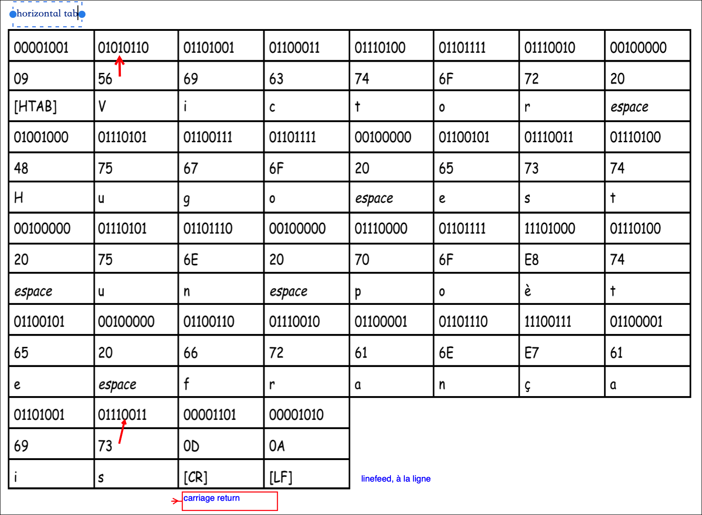
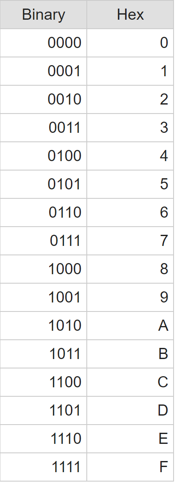
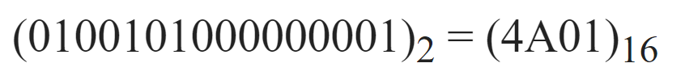
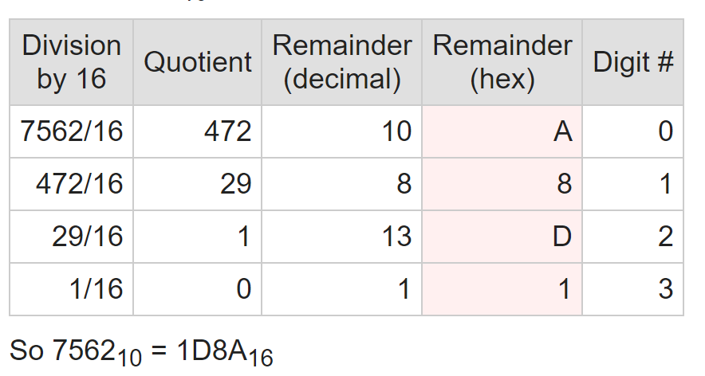
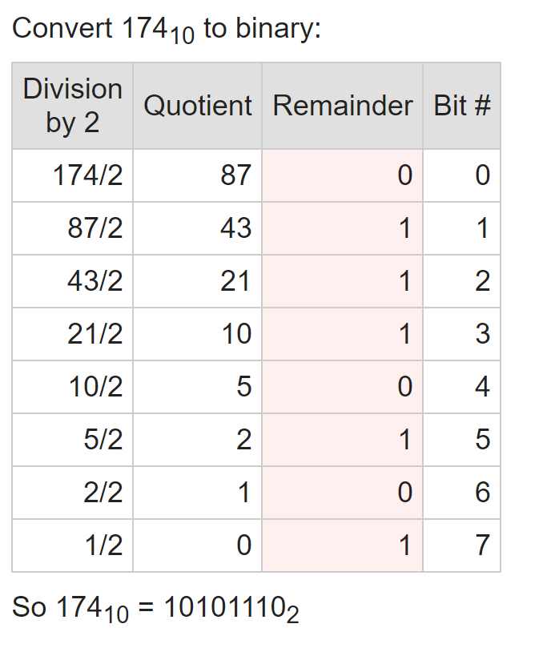
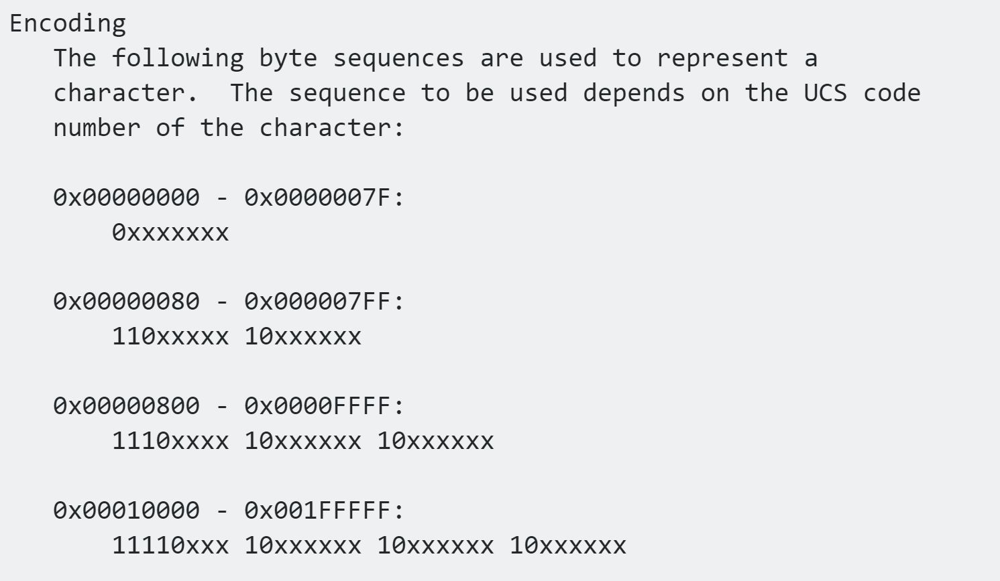
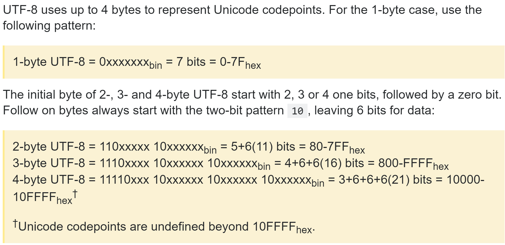

## Béaba

### Des octets au code ASCII
* iso
https://www.wikiwand.com/en/ISO/IEC_8859#/The_parts_of_ISO/IEC_8859
mac : https://www.wikiwand.com/en/Mac_OS_Roman
* Un fichier est une suite de bits organisées en octets sur un support de mémoire externe (local ou distant), à laquelle on a associé un nom.

* Un répertoire est une unité d’organisation logique des fichiers.

On la visualise sous la forme d’une arborescence.

### Conversion binaire hexa decimal

https://www.wolframalpha.com/
1 byte = 8 bits, 1 kb = 2*10 bytes,  mb, gb, tb,

https://www.google.com/search?q=%C3%A9&oq=%C3%A9&aqs=chrome..69i57j35i39j0l5j69i61.2818j0j7&sourceid=chrome&ie=UTF-8

Cf. ci-après pour un aperçu.

0D0A
09 = HT
0A = LF passage a la ligne linux
0D = CR mac
20 = space

80-9F non utilise par les conventions iso 128-159, 160 - 255 pareil

FF = end
https://www.convertworld.com/fr/mesures-informatiques/octet-byte.html
calculate logarithme logarithm
https://www.dcode.fr/logarithme
"U+" (that's just what they do, it has no other meaning than "this is a Unicode code point")
0x = hexa
hexa, binary to decimal easy
binary to hex : https://www.rapidtables.com/convert/number/how-binary-to-hex.html

hex to binary :
the same
decimal to hex :

decimal to binary :

convert from code points to utf8
https://stackoverflow.com/questions/6240055/manually-converting-unicode-codepoints-into-utf-8-and-utf-16

